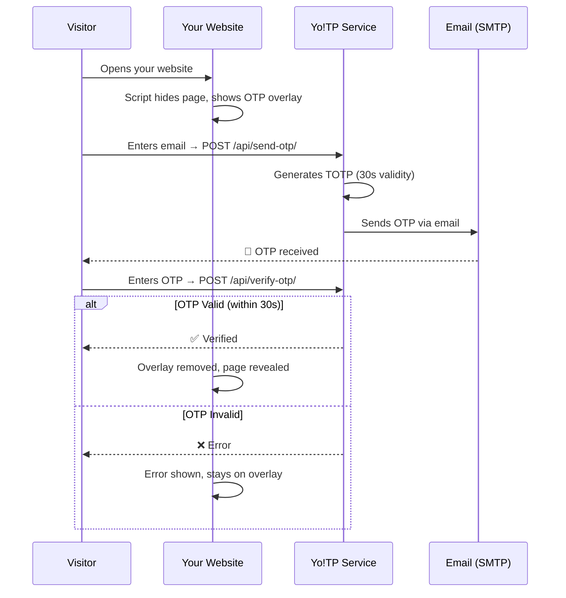
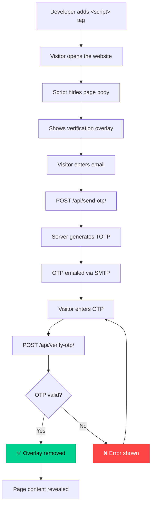

# 🛡️ Yo!TP

**Email OTP Verification as a Service**

Add email OTP verification to **any website** with a single `<script>` tag.
No signup, no API keys, no backend configuration required.

[](https://github.com/multiverseweb/Yo!TP)


---

## 🚀 Quick Start

Add this single line to any HTML page to protect it with email OTP verification:

```html
<script src="https://YOUR-DOMAIN/static/js/yotp.js"></script>
```

That's it. When visitors open the page, they'll see a verification overlay asking for their email. They receive a 6-digit OTP valid for 30 seconds. Only after entering the correct code can they access your page.

---

## 📋 Table of Contents

- [How It Works](#-how-it-works)
- [Features](#-features)
- [Integration Guide](#-integration-guide)
- [API Reference](#-api-reference)
- [Self-Hosting](#-self-hosting)
  - [Local Development](#local-development)
  - [Deploy to Render](#deploy-to-render)
  - [Deploy with Docker](#deploy-with-docker)
- [Architecture](#-architecture)
- [Project Structure](#-project-structure)
- [Security](#-security)
- [Contributing](#-contributing)
- [License](#-license)

---

## ⚙️ How It Works



1. **Script loads** → Immediately hides the page content and shows a verification overlay
2. **Email entered** → A 6-digit OTP is sent to the email address
3. **OTP verified** → Overlay disappears, original page content is revealed
4. **OTP wrong** → Error message shown, user can retry or request a new code
5. **Session stored** → Verification is saved in `sessionStorage` (lasts until tab is closed)

---

## ✨ Features

| Feature | Description |
|---|---|
| 📝 **One-Line Integration** | Single `<script>` tag — no npm, no build tools, no config |
| ⏱️ **30-Second OTP** | Time-based OTP using the TOTP standard (RFC 6238) |
| 🔒 **Brute-Force Protection** | Max 5 attempts per session, rate limiting on OTP requests |
| 🎨 **Premium UI** | Dark glassmorphism overlay with smooth animations |
| 📱 **Fully Responsive** | Works on desktop, tablet, and mobile |
| 🌐 **Universal Compatibility** | Works with any website — static HTML, React, Vue, WordPress, etc. |
| 🔑 **No Registration Required** | Visitors only need an email — no accounts, no passwords |
| ♻️ **Session Persistence** | Verified users aren't asked again within the same browser session |
| 📧 **Gmail SMTP** | Reliable email delivery via Gmail App Passwords |
| 🐳 **Docker Ready** | Dockerfile included for containerized deployment |
| 🚀 **Render Ready** | Easy deployment to Render with standard environment variables |

---

## 📦 Integration Guide

### Basic Usage

Add the script tag to any HTML page:

```html
<!DOCTYPE html>
<html>
<head>
  <title>My Protected Page</title>

  <!-- Add this one line to protect your page -->
  <script src="https://YOUR-DOMAIN/static/js/yotp.js"></script>
</head>
<body>
  <h1>Secret Content</h1>
  <p>This content is only visible after email verification.</p>
</body>
</html>
```

### How the Overlay Works

- The script **automatically hides your page** and shows a full-screen verification overlay
- The user **cannot access or see any page content** until they verify their email
- After successful verification, the overlay fades out and the original page appears
- Verification is stored in `sessionStorage` — refreshing the page doesn't re-trigger verification
- Opening a new tab/window **will** require re-verification

### No Configuration Needed

The script automatically detects the Yo!TP service URL from its own `src` attribute. No API keys, no initialization code, no additional configuration.

---

## 🗺️ API Reference

For custom integration, you can use the REST API directly.

### Send OTP

```
POST /api/send-otp/
Content-Type: application/json
```

**Request:**
```json
{
  "email": "user@example.com"
}
```

**Response (200):**
```json
{
  "token": "session-token-string",
  "message": "OTP sent successfully."
}
```

**Error Responses:**
- `400` — Invalid email
- `429` — Rate limited (max 5 requests per email per 5 minutes)
- `500` — Email delivery failure

### Verify OTP

```
POST /api/verify-otp/
Content-Type: application/json
```

**Request:**
```json
{
  "email": "user@example.com",
  "otp": "123456",
  "token": "session-token-string"
}
```

**Response (200):**
```json
{
  "verified": true,
  "message": "Verification successful."
}
```

**Error Responses:**
- `400` — Invalid OTP, expired session, or too many attempts

---

## 🏠 Self-Hosting

### Prerequisites

- **Python** 3.10+
- **pip** (Python package manager)
- **Git**
- A **Gmail account** with [App Passwords](https://myaccount.google.com/apppasswords) enabled

### Local Development

```bash
# Clone the repository
git clone https://github.com/multiverseweb/Yo!TP.git
cd Yo!TP

# Create and activate virtual environment
python -m venv venv
# Windows:
venv\Scripts\activate
# macOS/Linux:
source venv/bin/activate

# Install dependencies
pip install -r requirements.txt

# Set environment variables
# Windows PowerShell:
$env:EMAIL_USER="your-email@gmail.com"
$env:EMAIL_PASS="your-gmail-app-password"
# macOS/Linux:
export EMAIL_USER=your-email@gmail.com
export EMAIL_PASS=your-gmail-app-password

# Run migrations
python manage.py migrate

# Start the server
python manage.py runserver
```

Open **[http://127.0.0.1:8000/](http://127.0.0.1:8000/)** to see the landing page.

> [!IMPORTANT]
> You must use a **Gmail App Password**, not your regular Gmail password. Generate one at [Google App Passwords](https://myaccount.google.com/apppasswords).

### Deploy to Render

1. Go to [render.com](https://render.com/) and log in
2. Click **"New +"** → **"Web Service"**
3. Connect your GitHub repository
4. Configure the service:
   - **Runtime**: Python
   - **Build Command**: `pip install -r requirements.txt`
   - **Start Command**: `python manage.py migrate --noinput && python manage.py collectstatic --noinput && gunicorn project_yotp.wsgi --bind 0.0.0.0:$PORT`
5. Add the following **Environment Variables**:

   | Variable | Value |
   |---|---|
   | `EMAIL_USER` | Your Gmail address |
   | `EMAIL_PASS` | Your Gmail App Password |
   | `DJANGO_ALLOWED_HOSTS` | `.onrender.com` |
   | `CSRF_TRUSTED_ORIGINS` | `https://*.onrender.com` |
   | `SECRET_KEY` | A strong random secret key |
   | `DEBUG` | `False` |

6. Click **Deploy**

> [!TIP]
> Generate a secure `SECRET_KEY`:
> ```bash
> python -c "from django.core.management.utils import get_random_secret_key; print(get_random_secret_key())"
> ```

### Deploy with Docker

```bash
# Build the image
docker build -t yotp .

# Run the container
docker run -p 8000:8000 \
  -e EMAIL_USER=your-email@gmail.com \
  -e EMAIL_PASS=your-app-password \
  -e DJANGO_ALLOWED_HOSTS="localhost 127.0.0.1" \
  -e SECRET_KEY=your-secret-key \
  yotp
```

---

## 🏗️ Architecture



---

## 📁 Project Structure

```
Yo!TP/
├── authapp/                      # Core application
│   ├── templates/authapp/
│   │   └── landing.html          # Marketing / landing page
│   ├── admin.py                  # OTPSession admin registration
│   ├── apps.py                   # App configuration
│   ├── models.py                 # OTPSession model
│   ├── urls.py                   # API route definitions
│   └── views.py                  # API views (send-otp, verify-otp)
├── project_yotp/                  # Django project settings
│   ├── settings.py               # Settings (CORS, email, static)
│   ├── urls.py                   # Root URL configuration
│   ├── wsgi.py                   # WSGI entry point
│   └── asgi.py                   # ASGI entry point
├── static/
│   ├── js/
│   │   └── yotp.js          # ⭐ The core script (core product)
│   └── styles/
│       └── style.css             # Landing page styles
├── .dockerignore
├── .gitignore
├── Dockerfile                    # Docker container config
├── LICENSE                       # MIT License
├── Procfile                      # Railway/Heroku process file
├── manage.py                     # Django management script
├── requirements.txt              # Python dependencies
└── README.md                     # This file
```

---

## 🛡️ Security

| Measure | Implementation |
|---|---|
| **TOTP Standard** | Uses `pyotp` with RFC 6238 TOTP, 30-second intervals |
| **Brute-Force Protection** | Max 5 verification attempts per session |
| **Rate Limiting** | Max 5 OTP requests per email per 5 minutes |
| **Session Expiry** | OTP sessions expire after 2 minutes |
| **CORS Enabled** | API accessible from any origin (by design) |
| **CSRF Exempt** | API endpoints are CSRF-exempt (JSON-based, no cookies) |
| **TLS Email** | SMTP connection uses TLS encryption (port 587) |
| **Secure Tokens** | Cryptographically secure session tokens (`secrets.token_urlsafe`) |

---

## 🤝 Contributing

Contributions are welcome! Here's how:

1. **Fork** the repository
2. **Create** a feature branch
   ```bash
   git checkout -b feature/amazing-feature
   ```
3. **Commit** your changes
   ```bash
   git commit -m "Add amazing feature"
   ```
4. **Push** to the branch
   ```bash
   git push origin feature/amazing-feature
   ```
5. **Open** a Pull Request

> [!NOTE]
> Please follow the existing code style and include appropriate documentation.

---

## 📄 License

This project is licensed under the **MIT License** — see the [LICENSE](LICENSE) file for details.

---

<div align="center">

**Made with ❤️ by [Tejas Gupta](https://github.com/multiverseweb)**

⭐ Star this repo if you found it useful!

</div>
